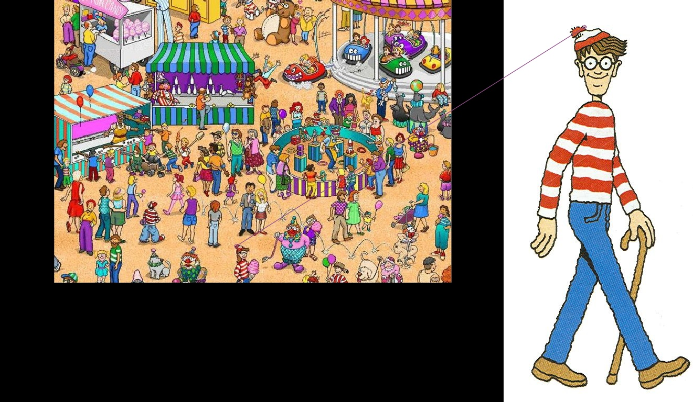
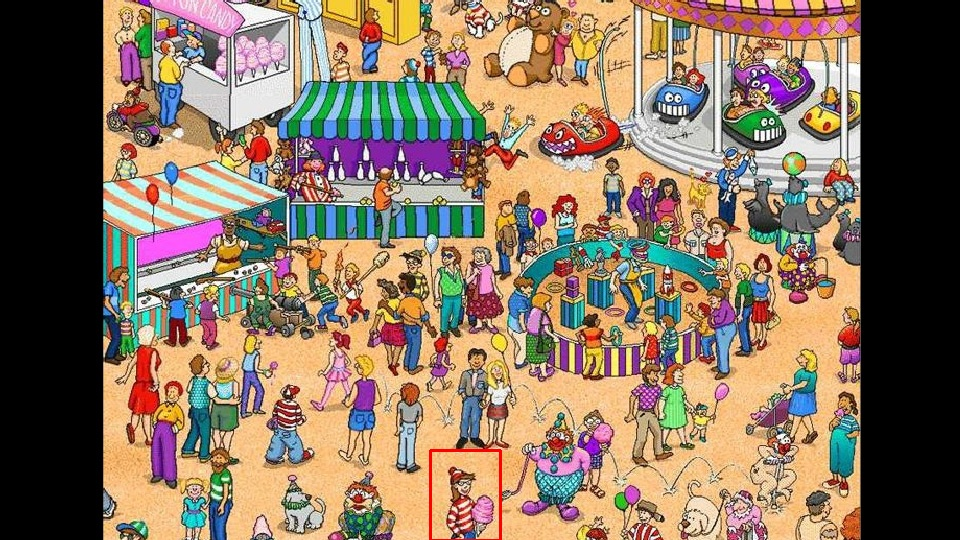

# wheres-waldo
A Where's Waldo puzzle solver.

## First Approach:
Using feature matching on a query image while using a reference image of Waldo

## Second Approach:
Using template matching and performing a similar task but requires an near exact match with Waldo in reference
 

To do this the image of Waldo was *manually* extracted from the query image itself and then compared.  

This seems to defeat the purpose of solving the puzzle. So for the next approach a pre-existing bigger training set of images will be used to train the model to the different kinds of appearances Waldo can have. 

## Third Approach:
A neural network method that is currently in progress
